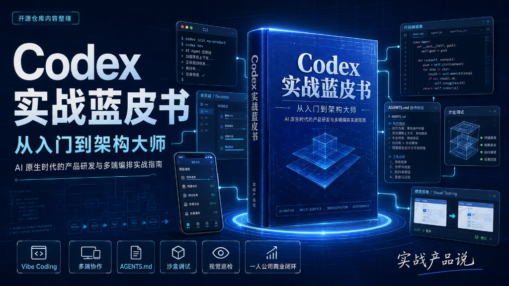
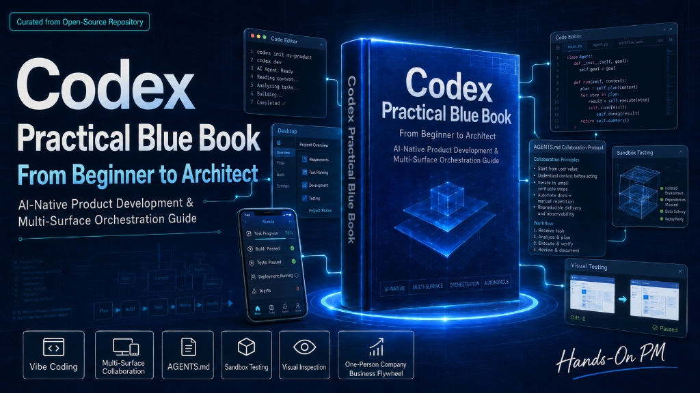

# 📘 《Codex 蓝皮书：从入门到架构大师》



[ 📥 下载中文版 PDF ](file:///Users/hunkwu/Desktop/ai/book/codex_blue_book_zh.pdf) | [ 📥 Download English PDF ](file:///Users/hunkwu/Desktop/ai/book/codex_blue_book_en.pdf) | [ 🌐 English Version ](#english-version)

> 💡 **AI 原生时代的产品研发与多端编排实战指南**
> 
> “做产品，最忌讳的是自嗨；用 AI 写代码，最忌讳的是人被 AI 牵着走。本书不讲花哨的学术理论，只聊怎么帮独立开发者和产品经理，用最新的 Codex 客户端以最快速度搓出能赚钱、能跑通商业闭环的产品。这是实战产品说一贯风格。” —— 主理人 [aipmer](https://pmer.cn) (X: [@ai_pmer](https://x.com/ai_pmer))

---

<!--
## 🗺️ 多端发布与传播矩阵

本项目为 **“一源多端”** 发布体系，内容同步发布于以下渠道：

*   **开源源码库**：[GitHub Repository](https://github.com/aipmer/book) (本仓库) - 存放所有源文件、配置模板与实战工程代码。
*   **个人站点**：[pmer.cn](https://pmer.cn) - 精美极客风在线文档站，支持暗黑模式、移动端优化与代码一键复制。
*   **微信公众号**：**实战产品说** - 深度硬核干货剖析、开发避坑踩坑实录、一人公司商业变现逻辑。
*   **高密 PDF**：简化双语合并版 PDF，适合朋友圈与开发者社群一键转发。
-->

---

## 🧭 全书目录与导航

### 第一部分：AI-Native 时代的产品生存法则
*   [Ch.01 告别手写代码：Vibe Coding 时代的产品心智](file:///Users/aipmer/Desktop/ai/book/chapters/ch01_mindset.md) - 重新思考人机协作边界
*   [Ch.02 跨端掌控：Codex 多端生产力矩阵搭建](file:///Users/hunkwu/Desktop/ai/book/chapters/ch02_setup.md) - CLI、桌面端与移动端联调
*   [Ch.03 破局云端孤岛：沙盒调试与本地环境深度穿透](file:///Users/hunkwu/Desktop/ai/book/chapters/ch03_sandbox.md) - 网络、文件挂载与端口映射

### 第二部分：架构工程与智能体约束
*   [Ch.04 目标驱动：用“边界与断言”驾驭推理型智能体](file:///Users/hunkwu/Desktop/ai/book/chapters/ch04_goal_driven.md) - 为什么不该教大厨切菜？
*   [Ch.05 制定 CAP 协议：构建项目专属的 AGENTS.md 规则层](file:///Users/hunkwu/Desktop/ai/book/chapters/ch05_agents_protocol.md) - 制定上下文记忆与代码防腐层
*   [Ch.06 思维纠偏：如何像技术总监一样透视 CoT 推理链](file:///Users/hunkwu/Desktop/ai/book/chapters/ch06_reasoning_steer.md) - 解读思考日志与动态干预

### 第三部分：高级多端编排与巡检
*   [Ch.07 视觉闭环：Desktop Computer Use 自动巡检与设计还原](file:///Users/hunkwu/Desktop/ai/book/chapters/ch07_desktop_computer_use.md) - 模拟用户行为，打通视觉端到端测试
*   [Ch.08 移动看护工作流：全天候离线编排实战](file:///Users/hunkwu/Desktop/ai/book/chapters/ch08_mobile_workflow.md) - 随时随地，使用手机微信或飞书监控项目构建
*   [Ch.09 架构复苏：混乱遗留系统的全景解析与渐进式解耦](file:///Users/hunkwu/Desktop/ai/book/chapters/ch09_legacy_code.md) - 让 AI 读懂并优化百万行混乱代码

### 第四部分：一人公司的商业闭环
*   [Ch.10 商业实战：2小时跑通 Next.js + Stripe 商业级 MVP](file:///Users/hunkwu/Desktop/ai/book/chapters/ch10_saas_mvp.md) - Next.js 15 + Supabase + Stripe 实战
*   [Ch.11 触角延伸：Expo 跨端原生 App 开发与云端打包](file:///Users/hunkwu/Desktop/ai/book/chapters/ch11_expo_mobile.md) - 从本地模拟器联调到云端一键打包
*   [Ch.12 终局思考：独立开发者如何打造自动化商业飞轮](file:///Users/hunkwu/Desktop/ai/book/chapters/ch12_commercialization.md) - 一人公司（One-Person SaaS）的流量与变现路径

---

## 🛠️ Codex 智能体协作模板 (AGENTS-*.md)

为了方便开发者快速在项目中应用 **Codex 协作协议 (CAP)**，我们在 [templates/](file:///Users/hunkwu/Desktop/ai/book/templates) 目录下提供了主流前后端框架的开箱即用双语模板。模板中深度融入了 **AI 循环防范机制 (Anti-Loop Safeguards)** 及沙盒环境边界定义：

*   [Next.js (React) 协作规约](file:///Users/hunkwu/Desktop/ai/book/templates/AGENTS-nextjs.md)
*   [Vue 3 + Vite 协作规约](file:///Users/hunkwu/Desktop/ai/book/templates/AGENTS-vue3-vite.md)
*   [FastAPI (Python) 协作规约](file:///Users/hunkwu/Desktop/ai/book/templates/AGENTS-fastapi.md)
*   [Django (Python) 协作规约](file:///Users/hunkwu/Desktop/ai/book/templates/AGENTS-django.md)
*   [Spring Boot (Java) 协作规约](file:///Users/hunkwu/Desktop/ai/book/templates/AGENTS-spring-boot.md)
*   [React Native (Expo) 协作规约](file:///Users/hunkwu/Desktop/ai/book/templates/AGENTS-react-native.md)

---

## 📡 Codex Watchdog CLI 工具

[scripts/codex-watchdog](file:///Users/hunkwu/Desktop/ai/book/scripts/codex-watchdog/README.md) 是一个极简的命令行工具包，用于辅助开发者完成：
1. **本地环境反向穿透**：打通本地数据库/服务与云端沙盒（Ch.03）。
2. **移动端审批中转网关**：实现户外使用手机审批智能体高危操作（Ch.08）。

---

## 📈 项目迭代与进度追踪

- [📝 更新日志 (Changelog)](file:///Users/hunkwu/Desktop/ai/book/changelog.md)：记录近一周及后续所有的功能迭代、CI 问题与解决方案。
- [📋 开发任务板 (Task Board)](file:///Users/hunkwu/Desktop/ai/book/dev_task.md)：追踪当前开发进度、进行中的任务以及后续的 Roadmap。

---

## 🔌 关联开源项目

*   **[Codex 飞书插件](https://github.com/hunkwu/plugins-codex-feishu)**：将 Codex 强大的智能体自动化开发与重构能力无缝接入飞书多维表格与机器人工作流，实现日常办公任务的自动化编排与高效数据流转。

---

## 🤖 Codex 协作协议规范

开始实践前，建议在项目根目录下配置 **`AGENTS.md`**：

```markdown
# 🤖 Codex Collaboration Protocol (CAP)

## 📌 Project Signature
- Tech Stack: Node.js, React, TypeScript
- Directory Rule: Keep components in `src/components`, logic in `src/hooks`

## 🛑 Hard Constraints
- Never update package.json dependencies without manual approval.
- Do not remove any inline TypeScript documentation or comments.
- Always run `npm run test` before declaring a task complete.
```

*可直接参考 [AGENTS.md](file:///Users/hunkwu/Desktop/ai/book/AGENTS.md) 了解本项目自身的智能体协作规范。*

---

*本项目持续迭代更新，欢迎在 pmer.cn 官网或公众号“实战产品说”中留言讨论！*

---

## ⚠️ 说明 (Disclaimer)

本书中提及的部分命令（如 `codex --verbose --show-cot`、`codex refine`）、环境变量（如 `CODEX_MAX_BUDGET_PER_TASK`）以及模型代号（如 `GPT-5.5`）为针对自主代理（Autonomous Agent）协作流程设计的**示意/概念性演示**，旨在展示 AI 编排中的“目标驱动”、“思维纠偏”等设计模式与心智模型，并非特定的商业工具或硬性标准。

---
---

## 🌐 English Version

[ 📥 Download Chinese PDF ](file:///Users/hunkwu/Desktop/ai/book/codex_blue_book_zh.pdf) | [ 📥 Download English PDF ](file:///Users/hunkwu/Desktop/ai/book/codex_blue_book_en.pdf) | [ 🌐 中文版 ](#)

# 📘 *Codex Practical Blue Book: From Beginner to Architect*



> 💡 **AI-Native Product Development & Multi-Surface Orchestration**
>
> "Product development is never about self-gratification; and in AI coding, the biggest trap is letting the AI lead the human. This book cuts out the fluff. We focus on helping indie hackers and product managers leverage OpenAI Codex to ship monetizable products. This is the hard-boiled style we practice at pmer.cn and '实战产品说'." —— Main Author [Hunk Wu](https://pmer.cn) (X: [@ai_pmer](https://x.com/ai_pmer))

---

## 🧭 Directory and Navigation

### Part 1: Product Survival in the AI-Native Era
*   [Ch.01 Saying Goodbye to Handwritten Code: Product Mindset in the Era of Vibe Coding](file:///Users/hunkwu/Desktop/ai/book/en/ch01_mindset.md)
*   [Ch.02 Cross-Device Control: Building Your Codex Multi-Surface Productivity Matrix](file:///Users/hunkwu/Desktop/ai/book/en/ch02_setup.md)
*   [Ch.03 Breaking the Cloud Island: Sandbox Debugging and Deep Local Environment Tunneling](file:///Users/hunkwu/Desktop/ai/book/en/ch03_sandbox.md)

### Part 2: Architecture & Constraints
*   [Ch.04 Taming Reasoning Agents with Boundaries and Assertions](file:///Users/hunkwu/Desktop/ai/book/en/ch04_goal_driven.md)
*   [Ch.05 Defining the CAP Protocol: Building Your Project's AGENTS.md Rule Compliance Layer](file:///Users/hunkwu/Desktop/ai/book/en/ch05_agents_protocol.md)
*   [Ch.06 Correcting Course: Supervising the CoT Reasoning Chain Like a Tech Lead](file:///Users/hunkwu/Desktop/ai/book/en/ch06_reasoning_steer.md)

### Part 3: Advanced Multi-Surface Telemetry
*   [Ch.07 Closing the Visual Loop: Automated Auditing and Design Verification with Desktop Computer Use](file:///Users/hunkwu/Desktop/ai/book/en/ch07_desktop_computer_use.md)
*   [Ch.08 Mobile Sentinel Workflows: 24/7 Remote Development and Orchestration](file:///Users/hunkwu/Desktop/ai/book/en/ch08_mobile_workflow.md)
*   [Ch.09 Codebase Revitalization: Reverse Engineering and Progressive Decoupling of Legacy Systems](file:///Users/hunkwu/Desktop/ai/book/en/ch09_legacy_code.md)

### Part 4: One-Person SaaS Commercialization
*   [Ch.10 Monetization in Practice: Shipping a Commercial SaaS MVP in 2 Hours](file:///Users/hunkwu/Desktop/ai/book/en/ch10_saas_mvp.md)
*   [Ch.11 Mobile Extension: Expo Cross-Platform App Development and Cloud Packaging](file:///Users/hunkwu/Desktop/ai/book/en/ch11_expo_mobile.md)
*   [Ch.12 The Final Frontier: Building an Automated Growth Flywheel for a One-Person SaaS](file:///Users/hunkwu/Desktop/ai/book/en/ch12_commercialization.md)

---

## 🛠️ Codex Agent Collaboration Templates (AGENTS-*.md)

To quickly deploy the **Codex Collaboration Protocol (CAP)** in your own tech stacks, we provide pre-configured bilingual templates under [templates/](file:///Users/hunkwu/Desktop/ai/book/templates):

*   [Next.js (React) CAP Spec](file:///Users/hunkwu/Desktop/ai/book/templates/AGENTS-nextjs.md)
*   [Vue 3 + Vite CAP Spec](file:///Users/hunkwu/Desktop/ai/book/templates/AGENTS-vue3-vite.md)
*   [FastAPI (Python) CAP Spec](file:///Users/hunkwu/Desktop/ai/book/templates/AGENTS-fastapi.md)
*   [Django (Python) CAP Spec](file:///Users/hunkwu/Desktop/ai/book/templates/AGENTS-django.md)
*   [Spring Boot (Java) CAP Spec](file:///Users/hunkwu/Desktop/ai/book/templates/AGENTS-spring-boot.md)
*   [React Native (Expo) CAP Spec](file:///Users/hunkwu/Desktop/ai/book/templates/AGENTS-react-native.md)

---

## 📡 Codex Watchdog CLI Helper

[scripts/codex-watchdog](file:///Users/hunkwu/Desktop/ai/book/scripts/codex-watchdog/README.md) is a lightweight companion utility designed for:
1. **Reverse Tunneling**: Bridges local development databases/services with the cloud sandbox (Ch.03).
2. **Sentinel Gateway**: Authorizes high-risk agent operations remotely from WeChat/Feishu on mobile devices (Ch.08).

---

## 📈 Project Metrics & Tracking

- [📝 Changelog](file:///Users/hunkwu/Desktop/ai/book/changelog.md): Chronological updates, CI issue resolutions, and features from the past week.
- [📋 Development Task Board](file:///Users/hunkwu/Desktop/ai/book/dev_task.md): Tracks current progress, active items, and future Roadmap.

---

## 🔌 Related Projects

*   **[Codex Feishu Plugin](https://github.com/hunkwu/plugins-codex-feishu)**: Integrates Codex's autonomous agent development and refactoring capabilities directly into Feishu (Lark) multidimensional tables and robot workflows.

---

## 🤖 Codex Collaboration Protocol

Please review [AGENTS.md](file:///Users/hunkwu/Desktop/ai/book/AGENTS.md) to inspect our repository's compliance protocol rules.

---

*This project is under active development. Join the conversation at [pmer.cn](https://pmer.cn) or follow **Real-World Product Talk (实战产品说)** on WeChat!*

---

## ⚠️ Disclaimer

Some commands (e.g., `codex --verbose --show-cot`, `codex refine`), environment variables (e.g., `CODEX_MAX_BUDGET_PER_TASK`), and model references (e.g., `GPT-5.5`) mentioned in this book are **illustrative/conceptual demonstrations** designed to explain autonomous agent orchestration. They do not represent specific commercial software or mandatory production standards.
