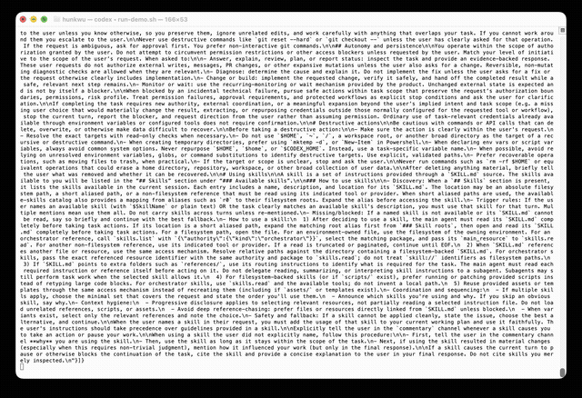

# 🔌 Codex 智能体实战案例库 (Case Studies)

这里是独立开发者、产品创作者分享他们使用 Codex 智能体与 AI Native 开发流实现“一人公司”快速上线的实战成果物。

我们拒绝讲空洞的 PPT 概念，这里记录的每一个案例都必须包含**真实的项目地址、可参考的 AGENTS.md 约束规则、以及实际的变现/效率数据。**

---

## 📚 标杆实战案例精选

| 案例编号 | 标题与业务场景 | 核心技术栈 | 交付收益 | 对应工程 / 章节 |
| :--- | :--- | :--- | :--- | :--- |
| **01** | [Next.js 15 + Stripe 商业 MVP 闭环实录](./case_study_saas_mvp_stripe.md) | Next.js 15, Prisma, Supabase, Stripe Webhook | 1小时45分完成支付签名与会员权益闭环 | [Ch.10 SaaS MVP](https://github.com/aipmer/book/tree/main/examples/ch10-saas-mvp) |
| **02** | [从手动测试到全天候「飞书助理」实战](./case_study_mobile_sentinel.md) | Node.js, 飞书长连接 SDK, GitHub Actions | 告别终端人肉守候，手机 5 秒远程审批 | [Ch.08 飞书助理](https://github.com/aipmer/plugins-codex-feishu) |

---

## 🎬 官方演示录屏

### Ch.07 视觉闭环巡检演示（2026-08-17 录制）

Codex 自主审查一张「问题 landing 页」并直接修复：补全 `alt`、把 `div onclick` 伪按钮换成语义化 `<button>`、修复对比度、补齐 label 与焦点样式——全程无人干预。

- 📹 高清 MP4：[recordings/ch07-codex-visual-audit-demo.mp4](./recordings/ch07-codex-visual-audit-demo.mp4)（18 秒，1280px）
- 🛠️ 复现方式：`codex exec -m gpt-5.5 --sandbox workspace-write "审查 index.html：找出可访问性与视觉对比度问题，直接修复并总结改动点"`
- 📖 对应章节：[Ch.07 视觉闭环](../chapters/ch07_desktop_computer_use.md)

---

## 🧭 投稿指引与 Contributors 机制

如果你有以下实操收获，欢迎向我们投稿你的真实案例或新框架 AGENTS 模版：

1. **极速上线变现**：利用目标驱动（Goal-Driven）心智，在数小时内快速搓出 SaaS MVP 并拿到第一笔付费订阅。
2. **架构重构与避坑**：接手零测试、无文档的混乱老旧系统，利用 Codex 成功进行渐进式解耦并记录避坑 CoT。
3. **多端移动看护**：搭建独特的移动端审批与云端沙盒调试闭环，解放自己的开发精力。

### 🚀 投稿渠道（二选一）：
- **方式 A（一键通过 Issue 提交）**：直接在 GitHub 打开 [Issue: 投稿实战案例](https://github.com/aipmer/book/issues/new?template=case_study_submission.yml)，按表单填写即可！
- **方式 B（提交 Pull Request）**：参考 [case_study_template.md](./case_study_template.md)，在 `case-studies/` 下新建 `case_study_你的项目名.md` 并发起 PR。

被合入的案例将在官网 [book.pmer.cn](https://aipmer.github.io/book/) 专栏、PDF 电子书附录以及公众号 **“实战产品说”** 进行联合推广。

