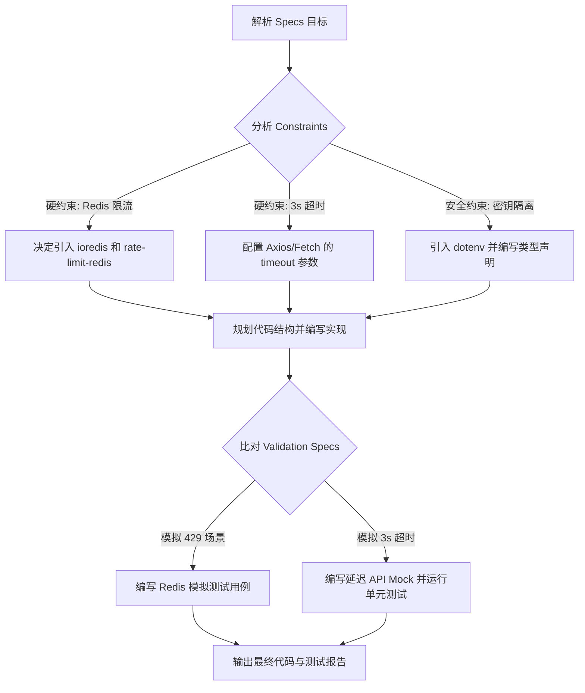

[ 🏠 主目录 ](../README.md) | [ ⬅️ 上一章 (Ch.03) ](./ch03_sandbox.md) | [ ➡️ 下一章 (Ch.05) ](./ch05_agents_protocol.md) | [ 🌐 English ](../en/ch04_goal_driven.md)

# Ch.04 目标驱动：用“边界与断言”驾驭推理型智能体

在以 OpenAI o3 / GPT-5.5 等推理模型为核心的 Codex 时代，传统的 Prompt 工程正在变得累赘。推理模型具有庞大的内生规划（Internal Planning）空间，过细的执行步骤反而会限制其能力的发挥。

本章将分享如何在实际开发中，用“产品 Specs”的方式去驱使 Codex。

---

## 4.1 核心逻辑：别教米其林大厨怎么切菜

如果你雇了一位米其林大厨（推理模型），你肯定不会在旁边指手画脚：
❌ *“请你拿起菜刀，把土豆切成 2mm 的细丝，然后把锅烧热，倒入 15g 花生油，下锅翻炒 3 分钟，最后放 3g 盐。”*

这叫**“过程驱动”**。不仅累，而且很容易因为火候不同而把菜烧焦。

在“实战产品说”中，我更推崇**“目标驱动”**的合作方式：
✅ *“我需要一盘香脆可口的土豆料理作为牛排的配菜。要求：热量控制在 200 卡内，不能使用黄油，并且必须在 15 分钟内出锅。”*

你给出了**目标（Goal）**、**红线（Constraints）**和**时间窗口（Validation）**，剩下的烹饪细节全部交给大厨去推理和尝试。

---

## 4.2 目标驱动的 Markdown 结构规范

当你在本地或云端向 Codex 发起编码任务时，不要堆砌毫无章法的对话，使用以下标准 Markdown 格式：

```markdown
# 🎯 Goal
[描述你希望达到的最终状态。例如：实现一个支持 Github 登录并能存储用户偏好设置的路由。]

# 🛑 Constraints (红线约束)
- [安全红线，如：绝对不能将密钥明文写入代码。]
- [技术选型限制，如：必须使用原生的 CSS Grid，不能使用 Tailwind。]
- [代码防污染，如：禁止修改 /src/legacy 目录下的任何文件。]

# 🧪 Validation Specs (验证标准)
- [自动化测试，如：运行 npm run test:unit 必须 100% 通过。]
- [边界行为，如：当输入为空时，接口必须返回 400 Bad Request 且带有 JSON 错误提示。]
```

---

## 4.3 真实案例对比：传统 Prompt vs 目标驱动 Specs

假设我们要写一个 **“带 Redis 限流的 API 代理服务”**。

### ❌ 传统过程驱动型 Prompt
> “请帮我用 Express 写一个 API 代理。首先引入 express 和 express-rate-limit。然后配置 rate-limit，设置 windowMs 为 15 分钟，max 为 100 次。接着写一个路由 `/api/proxy`，使用 axios 请求第三方 API `https://api.github.com`。如果请求成功就返回数据，如果失败就返回 500 错误。注意在请求头里带上 Authorization Bearer Token。”

### ✅ 目标驱动 Specs（实战产品说推荐）
```markdown
# 🎯 Goal
实现一个 Express API 代理路由，代理所有发往 GitHub API 的请求。

# 🛑 Constraints
- 必须使用 Redis 作为限流器的数据源，禁止使用内存型限流，以支持多实例部署。
- 代理请求的超时时间（Timeout）必须硬性限制在 3000ms 以内，防止挂起主线程。
- 严禁将 GitHub Token 写入代码或日志中，必须从 `process.env.GH_TOKEN` 安全读取。

# 🧪 Validation Specs
- 在 1 分钟内发送超过 60 次请求时，代理必须返回 429 Too Many Requests。
- 当代理请求发生超时或网络错误时，必须返回 504 Gateway Timeout，并带有结构化 JSON 响应。
```

---

## 4.4 Codex 对 Specs 的推理过程分析

当你把这套规范扔给 Codex 后，它的内部思维链（Chain of Thought）会这样运转：



你会发现，Codex 甚至会自动处理 Redis 连接重试、超时的捕获等健壮性逻辑——而这些在以前，是需要你写上百字去千叮咛万嘱咐的。

**把逻辑规划权让渡给 AI，把验收标准牢牢攥在自己手里。** 这就是 AI 时代最高效的人机协同法则。

---

[ 🏠 主目录 ](../README.md) | [ ⬅️ 上一章 (Ch.03) ](./ch03_sandbox.md) | [ ➡️ 下一章 (Ch.05) ](./ch05_agents_protocol.md) | [ 🌐 English ](../en/ch04_goal_driven.md)
