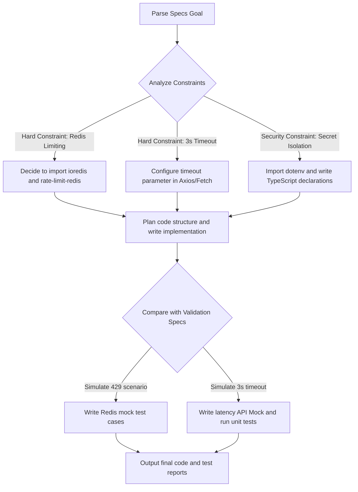

[ 🏠 Index ](../README_EN.md) | [ ⬅️ Prev (Ch.03) ](./ch03_sandbox.md) | [ ➡️ Next (Ch.05) ](./ch05_agents_protocol.md) | [ 🌐 中文版 ](../chapters/ch04_goal_driven.md)

# Ch.04 Goal-Driven Engineering: Taming Reasoning Agents with Boundaries and Assertions

In the era of Codex, powered by reasoning models like GPT-5.5, traditional prompt engineering is becoming obsolete. Reasoning models possess immense internal planning space; over-specifying execution steps only limits their efficiency.

This chapter shares how to guide Codex using a "product specs" approach in actual development.

---

## 4.1 Core Logic: Don't Tell a Michelin Chef How to Chop

If you hired a Michelin-starred chef (a reasoning model), you certainly wouldn't stand beside them micromanaging every move:
❌ *“Please take the kitchen knife, chop the potato into 2mm thin strips, heat up the pan, pour in 15g of peanut oil, stir-fry for 3 minutes, and finally add 3g of salt.”*

This is **"process-driven"**. It is exhausting, and it easily ruins the dish due to minor differences in heat.

In "Real-World Product Talk", I advocate a **"goal-driven"** collaborative approach:
✅ *“I need a crispy, delicious potato side dish to pair with the steak. Constraints: calories must be under 200 kcal, no butter allowed, and it must be plated within 15 minutes.”*

You provide the **Goal**, the **Constraints**, and the **Validation criteria**, and leave all the cooking details to the chef to plan and execute.

---

## 4.2 The Goal-Driven Markdown Specs Template

When triggering coding tasks for Codex locally or in the cloud, avoid chaotic conversational prompts. Use the following standard Markdown format instead:

```markdown
# 🎯 Goal
[Describe the desired end state clearly. Example: Implement a route supporting GitHub OAuth and saving user preferences.]

# 🛑 Constraints
- [Security red lines, e.g., Never write credentials as plain text in the codebase.]
- [Tech stack limitations, e.g., Must use native CSS Grid; Tailwind is not allowed.]
- [Anti-pollution rules, e.g., Prohibited from modifying any file under /src/legacy.]

# 🧪 Validation Specs
- [Automated testing, e.g., Running `npm run test:unit` must pass 100%.]
- [Edge behaviors, e.g., When inputs are empty, the API must return 400 Bad Request with a structured JSON error payload.]
```

---

## 4.3 Real Case Comparison: Traditional Prompt vs. Goal-Driven Specs

Suppose we need to write a **"Redis-based Rate-Limiting API Proxy Service"**.

### ❌ Traditional Process-Driven Prompt
> "Please help me write an API proxy with Express. First, import express and express-rate-limit. Then configure rate-limiting, setting windowMs to 15 minutes and max to 100. Then write a route `/api/proxy` using axios to request the third-party API `https://api.github.com`. If successful, return the data; if it fails, return a 500 error. Make sure to include the Authorization Bearer Token in the headers."

### ✅ Goal-Driven Specs (Recommended by Real-World Product Talk)
```markdown
# 🎯 Goal
Implement an Express API proxy route that forwards all incoming requests to the GitHub API.

# 🛑 Constraints
- Must use Redis as the rate-limiting data source (no memory-based limiting) to support multi-instance deployments.
- Limit the proxy request timeout strictly to 3000ms to prevent hanging the main thread.
- Never write the GitHub token into the codebase or logs. It must be safely fetched from `process.env.GH_TOKEN`.

# 🧪 Validation Specs
- Return a 429 Too Many Requests status when requests exceed 60 requests per minute from a single IP.
- Return a 504 Gateway Timeout status with a structured JSON response on timeout or proxy network errors.
```

---

## 4.4 Codex Reasoning Process for Specs

Once you throw these specs to Codex, its internal Chain of Thought (CoT) will operate like this:



You will notice that Codex automatically handles edge cases, such as Redis connection retries and error-catching on timeout—things that previously required hundreds of words of manual instruction.

**Delegate logic planning to the AI, but keep verification standards firmly in your own hands.** This is the most efficient human-machine collaboration method in the AI era.

---

[ 🏠 Index ](../README_EN.md) | [ ⬅️ Prev (Ch.03) ](./ch03_sandbox.md) | [ ➡️ Next (Ch.05) ](./ch05_agents_protocol.md) | [ 🌐 中文版 ](../chapters/ch04_goal_driven.md)
